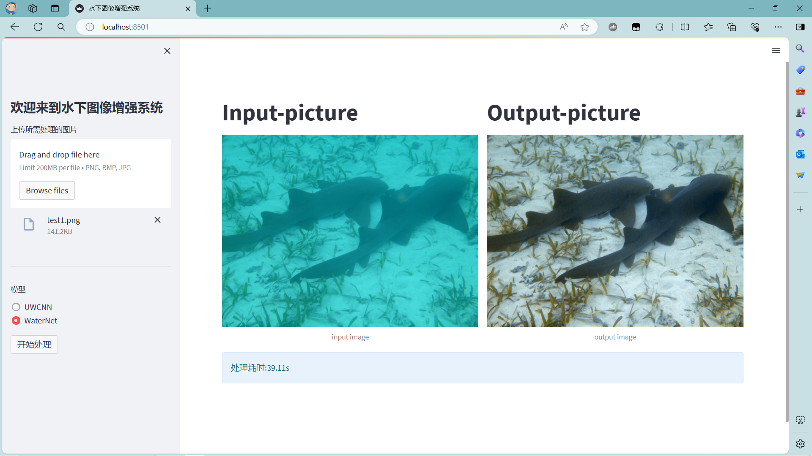
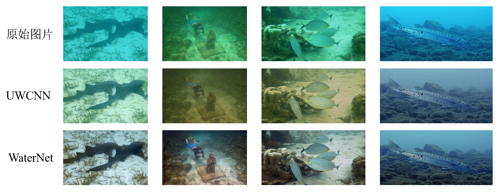

# UIE-DL
基于深度学习的水下图像增强系统，采用UWCNN和WaterNet网络，结合python的streamlit搭建的水下图像增强系统

### 系统界面如下：

### 效果对比:

### To Use:

1. 安装所需依赖库(testing at python==3.6.13 tensorflow==1.4.0 opencv-python==3.4.1.15)：

   `pip install -r requirements.txt`

2. 下载模型：

   UWCNN模型已包含在存储库中，WaterNet模型可在[dropbox]( https://www.dropbox.com/s/fkoox0t3jwrf92q/checkpoint.rar?dl=0 )或[百度网盘]( https://pan.baidu.com/s/1aWckT66dWbB0-h1DJxIUsg)进行下载，并解压放置于WaterNet文件夹中

3. 运行：

   `streamlit run app.py`

### 相关参考:

界面设计[web界面参考](https://github.com/LSTM-Kirigaya/super-easy-super-resolution)
网络模型[UWCNN](https://github.com/saeed-anwar/UWCNN)
网络模型[WaterNet](https://github.com/Li-Chongyi/Water-Net_Code)